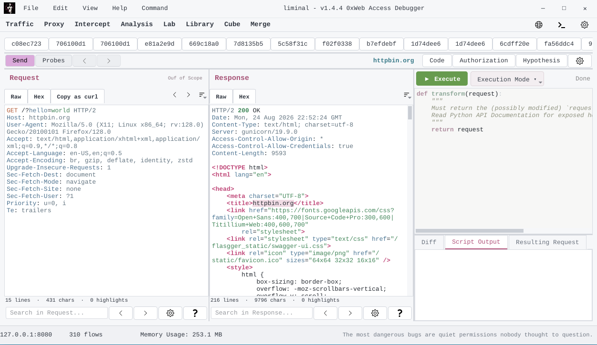

# Liminal

  <strong>Identity-Aware Web Security Analysis</strong>

  
  
  
  

Liminal is a closed-source security research platform designed to analyze authorization behavior in modern web applications.

It observes application behavior across multiple identities and contexts to help identify inconsistencies in access-control boundaries, including horizontal and vertical privilege escalation, cross-identity access, stale sessions, context-dependent bypasses, and parameter manipulation.

Tested against real-world applications through authorized security research and bug bounty programs.

## Features

* Multi-identity authorization analysis
* Behavioral access-control modeling
* Cross-identity request testing
* Authorization boundary analysis
* HTTP/HTTPS interception
* HTTP/1.1 and HTTP/2 support
* Embedded Python editor and executor
* Security-oriented Python APIs
* Context-aware testing suggestions
* Request/response hooks
* Header injection and payload manipulation
* Endpoint filtering and blocking

## Integrated Research Environment

Liminal combines traffic interception, authorization analysis, and programmable testing in a single environment.

The embedded Python runtime allows researchers to inspect and manipulate traffic, automate repetitive testing, and build custom analysis workflows without leaving the proxy.

## Proxy

Liminal includes a custom HTTPS interception proxy developed in Python.

It supports dynamic certificate generation, TLS interception, HTTP/1.1, HTTP/2, and programmable request/response processing.

Screenshots

  

## Status

**Current version:** `v1.4.4`

**Platform:** Linux

**License:** Proprietary / Closed Source

## Responsible Use

Liminal is intended for authorized security testing, penetration testing, research, and controlled environments.

Only test systems for which you have explicit permission.

## License

Liminal is proprietary and closed-source. See [`LICENSE`](LICENSE) for the applicable terms.
